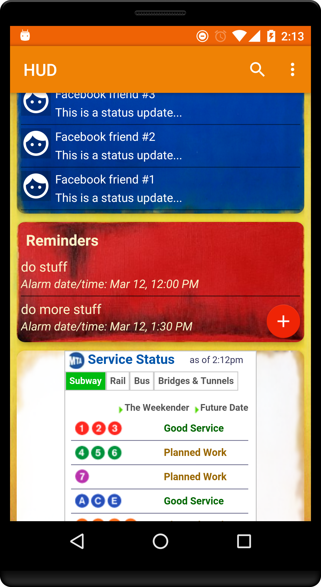
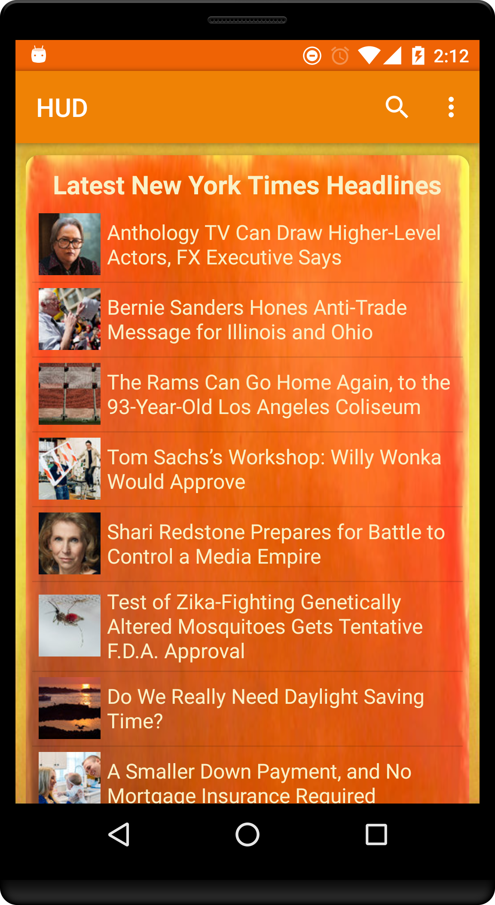

#  HUD 
---
##### *Christian Erickson, Charlie Drews, William Tygret, Kyle McNee (powered by Touchlab)*
___
##### 3/11/2016

###  WHAT IT DOES:
HUD (short for heads-up-display), is a personal assistant app that keeps track of top news stories, Facebook posts, reminders, and other pertinent info in an interface that is fast, clean, and intuitive.  We like to say that HUD provides you with what's important, when it's important.  Unlike other personal assistant apps, HUD does not rely on collecting your search history to deliver relevant cards to you.  Any info you provide to it is done so voluntary.  When it comes to personal data, we favor an opt-in approach to an opt-out one.

### BUGS:
* When adding a reminder, the first reminder added will occasionally not show up, but subsequent reminders show up just fine.
* Facebook....oh god pelase send help.
* The weather API never came to fruition either.
* Sometimes cardview animations run twice, especially if the cards are refreshed.
* There is a search view in the toolbar, but sadly no search functionality... yet.

### LINK:
https://trello.com/b/K1z4GuIq/project-3

### SCREENSHOTS:

