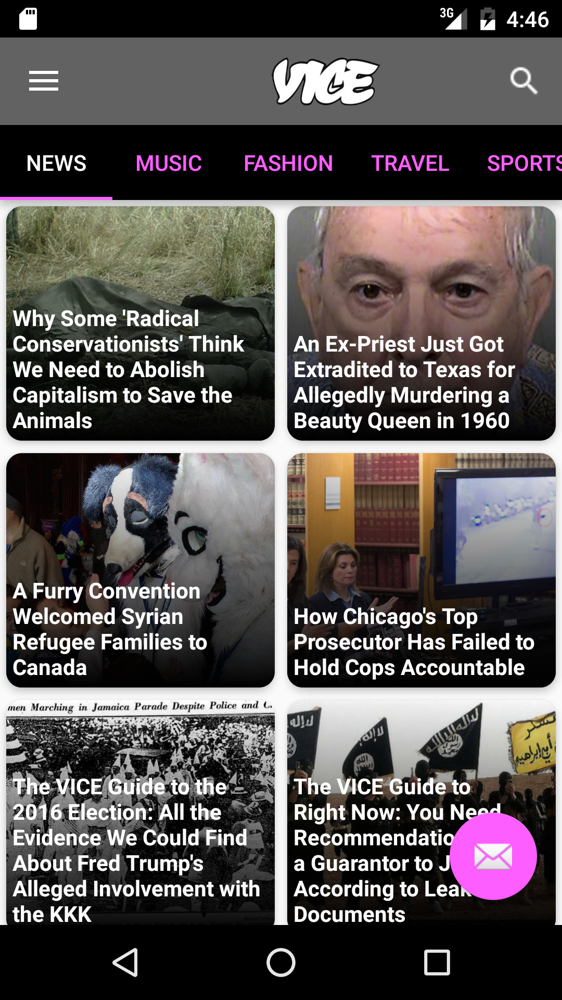
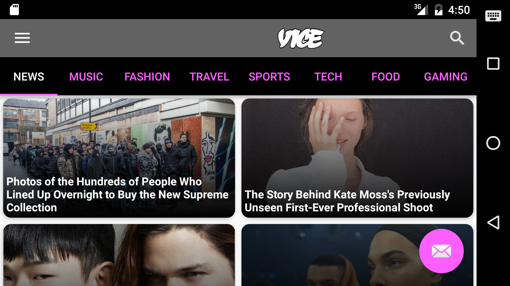
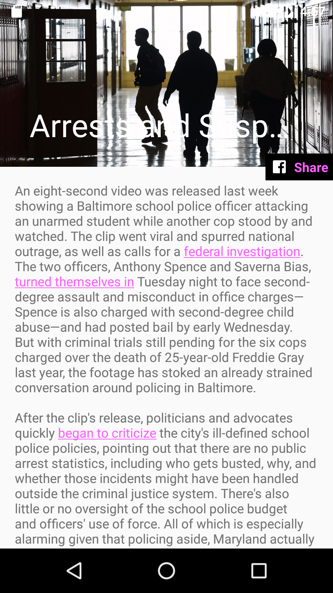

# **Android Development Immersive Project 3**
## **Title: Vice City**
## **Developers: David Sarker, Greg Daly, Austin Jones, Mike Kwon**

#### Overview

Vice City is a graphically-driven User Interface with intuitive navigation that allows Users to quickly & easily browse Vice’s rich collection of content, and minimize the effort required to find content that’s personally relevant.  All content is pulled directly from Vice's servers via their API's. 

---

#### Main Activity

The launch screen immediately provides users with a Fragment containing the latest "NEWS" category items, encapsulated in a DrawerLayout.  The different Vice categories can be navigated without leaving the Main Activity by swiping between tabs in the Fragment's TabLayout.  Each tab corresponds to a different vice API call based on searchable category, which populates the Fragment's RecyclerView with CardViews holding snapshots of article content.  Card clicks will launch the specific article in a separate Story activity.

The DrawerPane is intended to launch different content searches within Vice content.

While navigating the Main Activity, the user can click the floating action button to initiate a Manual Sync which will refresh the article content displayed.  Additionally, displayed content can be filtered further via SearchView functionality in the Actionbar.

All story content in the Main Activity is populated via API calls launched within Asynchronous Tasks.  These API calls directly populate the RecyclerViewAdapter's arraylist, and simultaneously populate a background database which enables further searches into displayed content.

---

#### Story Activity

The full details for each individual article is displayed in a seperate Story Activity.  Rich Media content that may be embedded within each story leverages Google Picasso (for images) and Vice's ooyala player (for videos) to optimize memory management.

The floating action button enables the user to share the selected article to their Facebook network via the Facebook API.  Upon successfully posting to their facebook feed, a notification will be posted to the user's phone confirming the action.

---

#### Additional Content

* Automated Unit Tests were built to test each of the Asynchronous tasks that retrieve Vice content via network API calls
* Network connectivity tests are executed in both the Main Activity and Story Activity to confirm that network access is available prior to attempting network calls
* All network calls are administered in background threads off the UI via Asynchronous Tasks and/or Sync Adapter methods
* JSON data retrieved from Vice API calls are parsed into customized 'ViceArticle' objects for use throughout the app
* Both activity layouts are customized for Portrait and Landscape orientations
* Sync Adapters, Content Providers, and Content Observers are leveraged to retain article data in a persistent SQL Database for future reference via Manual Syncs and Searches

---

#### Bugs to be addressed

* TBD
* TBD